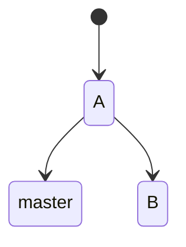
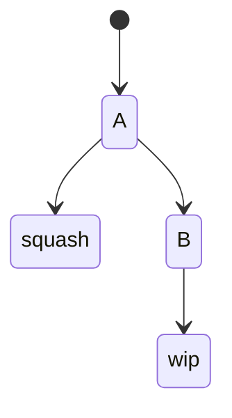
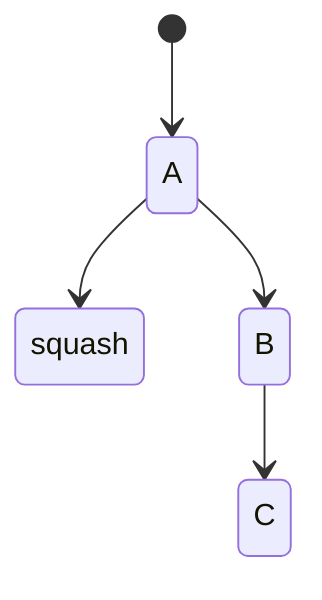

<!-- .slide: id="frontmatter" -->

## git to the rescue!
## Beers 'n' Learn 


---


---

#### commit hash

```bash
sha1 {
    commit message
    committer
    commit date
    author
    authoring date
    Hash of tree structure for the directory
    Parent hash(es)
}
```

---

#### git config

Useful for configuring user name and email per repository. 

Suppose my global email is `john.doe@mail.com` and I want to work with another account `jdoe@gmail.com` in a particular repo:

```bash
git config --local user.name "jdoe"
git config --local user.email "jdoe@gmail.com" 
```

Also useful for aliases:

```bash
git config --global alias.lg \
   'log --graph --oneline --decorate --all'
```

---

#### git remote

Suppose we want to work with two different histories in the same repository:

```bash
git remote -v
> origin git@github.com:ncordon/git-test.git (fetch)
> origin git@github.com:ncordon/git-test.git (push)
```

```bash
git remote add template git@github.com:ncordon/git-template.git
```

```bash
git fetch template
git reset --hard template/master
git remote remove template
```

---
<!-- .slide: id="rebase-ii" -->

#### git rebase


`git` stores a whole copy of the repo in each node, so what if we left a secret stored since A?

---

```bash
git rebase -i <commit hash | --root>
```

would let us modify commits that happened after the provided hash.

There is a better editor for the what `rebase prompts`: [`rebase-editor`](https://github.com/sjurba/rebase-editor): 

```bash
git config --global sequence.editor rebase-editor
```

---
<!-- .slide: id="rebase-ii" -->

If we run `git rebase -i A`, hashes would change and we would have to force push to `origin` to the corresponding branch: `git push --force`:


---

#### git stash



Let's suppose I (squash and) merge the branch into `master`, and continue working in own branch:


---
<!-- .slide: id="stash-ii" -->



where `wip` has not been commited. Then I could stash it, change to master, and pop from the stash:

```bash
git stash
git checkout master
git fetch origin && git reset --hard origin/master
git checkout -b new-branch
git stash pop
```

---
<!-- .slide: id="cherry-pick" -->

#### git cherry-pick



```bash
git checkout master
git fetch origin && git reset --hard origin/master
git checkout -b new-branch
git cherry-pick C
```

---

### Thanks for listening
